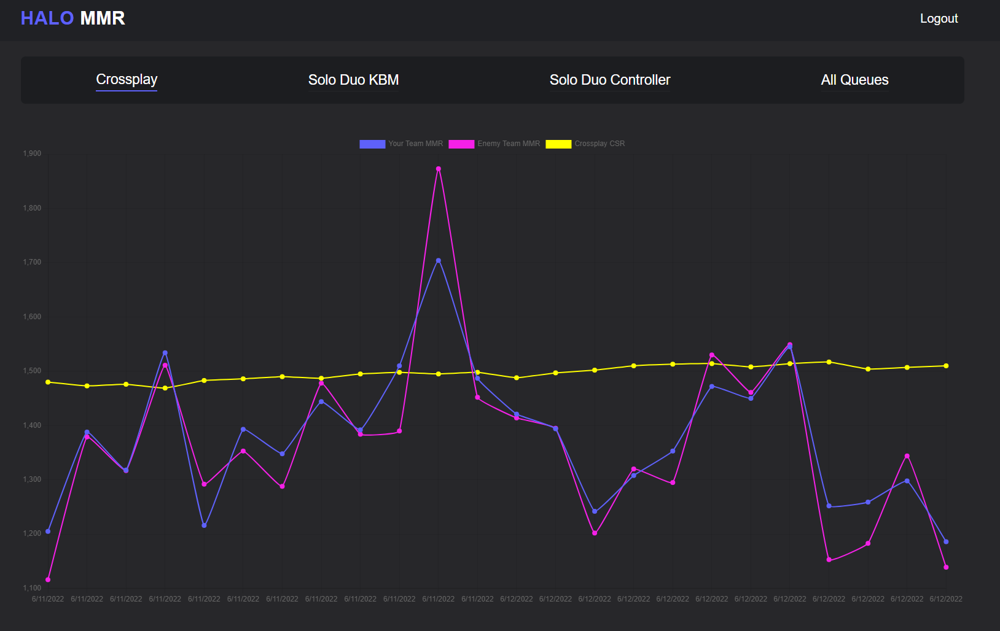
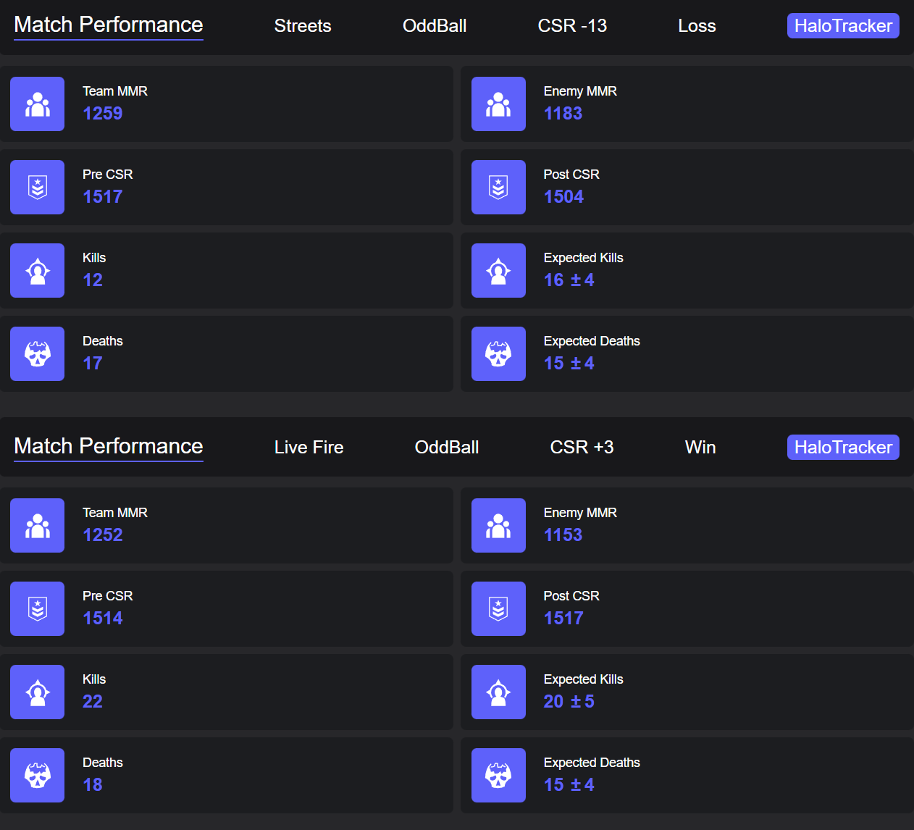

# Crypto Tracker

This web app fetches the top 100 cryptocurrency data from an API. 
It uses the returned data to display information about each cryptocurrency.
You can filter cryptocurrencies,view charts, and make a watchlist.
Live version: https://profound-lolly-382242.netlify.app/

## Built with

- React
- React Router V6
- JavaScript
- Tailwind CSS

## To do
- Add TypeScript
- New Login Page
